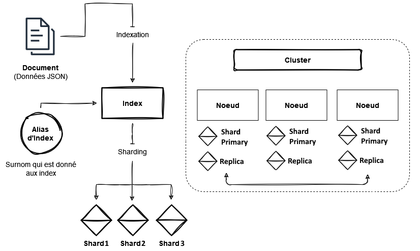

## Où se trouve les autres TP ?
- TP 01 - Branche [**`main`**](https://github.com/Itoshuga/ElasticSearch-ISITECH/tree/main)
- TP 02 - Branche [**`dev`**](https://github.com/Itoshuga/ElasticSearch-ISITECH/tree/dev)
- TP 03 - Branche [**`test`**](https://github.com/Itoshuga/ElasticSearch-ISITECH/tree/test)

# TP03

## Les Concepts d'Elasticsearch


### Comment Elasticsearch stocke ses données ?
Elasticsearch stocke les données sous forme de documents JSON dans des **index**. Chaque index regroupe des **documents** similaires. Les index sont divisés en fragments appelés **shards**, qui permettent la distribution des données. Chaque shard peut avoir des **réplicas**, qui sont des copies.

|  Base de données relationnelles  | Base NoSQL orienté document |
| ----------------- | --------------- |
|   Table    | Index  |
|   Lignes / Entrées / Row | Documents  |

Les **nœuds** d'un cluster Elasticsearch travaillent ensemble pour stocker et traiter les données. Lorsqu'un document est indexé, il est analysé, réparti entre les shards et traité par le cluster.

C'est grâce à un système de mise à l'échelle que Elasticsearch peut gérer efficacement une grande quantité de données. Grâce à tous ces concepts de **réplication**, et de **distribution de données** que Elasticsearch peut traiter un grand nombre de donnée rapidement.

### Pourquoi utiliser Scroll API ? Un bon paramètre de recherche pour la pagination ?
La Scroll API est une fonctionnalité mise en place par Elasticsearch qui à pour but principal de récupérer un grand nombre de résultat d'une requête de manière efficace. Elle maintient un état de contexte entre les requêtes, ce qui va venir offrir une pagination continue à travers les résultats.

Il est possible de l'utiliser dans notre console en effectuant le code suivant :

```json
GET /_search/scroll/
{
  "scroll_id" : "FGluY2x1ZGVfY29udGV4dF91dWlkDXF1ZXJ5QW5kRmV0Y2gBFkhnVF9OaEZ1UTE2cTduVmdQTFpQSEEAAAAAAAAUZRZOWXI4OXh0Z1FHV0NwSW9vM2JReWFR"
}
```

Il est nécessaire d'avoir un `scroll_id` pour pouvoir l'utiliser, il est possible d'en acquerir en utilisant le code suivant dans notre console :

```json
POST /index/_search?scroll=5m
{
  "size": 10,
  "query": {
    "match_all": {}
  }
}
```

Pour conclure la scroll API est le bon paramètre pour effectuer de la recherche paginée dans Elasticsearch. Elle permet de parcourir efficacement un grand ensemble de résultats de manière efficace et itérative.

### Quel est l'usage principal de Kibana ?
Kibana est une interface web qui permet de **rechercher** et de **visualiser des données** qui ont été **indexé** dans Elasticsearch. Elle sert aussi d'interface pour le monitoring, la gestion et la sécurité des clusters de la suite Elastic.

### Qu'est ce qu'un Dashboard ?
Un dashboard est une interface qui regroupe diffèrente visualisation et métrique sur l'ensemble des données indexé dans Elasticsearch. Il s'agit d'un espace où l'on peut organiser et afficher des graphiques, tableaux et autres éléments visuel pour analyser les données.